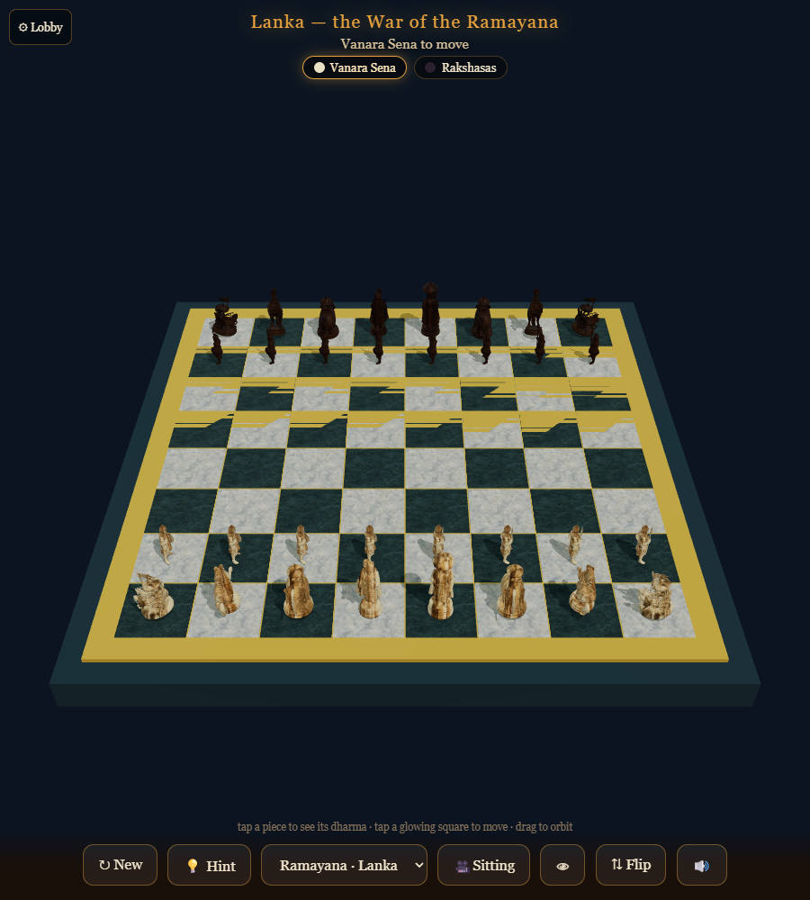

# Chaturanga — the four-army game of dharma

*Chaturanga* is the ancient Indian ancestor of chess — the game of the **four army
divisions**. This is a real-3D, mobile-first take on it: authentic Chaturanga piece
**identities** (Raja, Mantri, Ratha, Gaja, Ashva, Padati) that move by **modern chess
rules**, where every world teaches a moral through its pieces, and a **teaching AI**
explains the game as you play.

**▶ Play:** https://naveenneog.github.io/Chaturanga/ &nbsp;·&nbsp; **⬇ Android APK:** see [Releases](https://github.com/naveenneog/Chaturanga/releases/latest)



## Features
- **Play the Guru** — an alpha-beta chess AI with **5 difficulty levels** (Padati → Mantri),
  running in a Web Worker so it stays smooth on phones.
- **A coach** — a **Hint** that names the best move and *why*, and a blunder review that
  gently flags mistakes and shows the stronger move.
- **Openings trainer** — six classic openings (Italian, Ruy López, Sicilian, French,
  Queen's Gambit, King's Indian) walked **move-by-move** with a narrated lesson.
- **Piece inspector** — tap a piece to see a **rotating 3D render** and a diagram of how it
  moves and captures.
- **Warrior's Eye** — a piece-perspective camera that looks across the board from a piece.
- **Two themed worlds**, each with its own **army**, board art, teachings and a portrait
  cinematic intro: **Kurukshetra** (the Mahabharata) and **Lanka** (the Ramayana vanara host).
- **Local hotseat** (2-player, optional auto-flip), undo, captured-pieces tray, check
  highlight, under-promotion, read-aloud narration. No backend, works offline.

## Play / develop
```bash
npm install
npm run serve      # http://localhost:5174/
npm test           # node:test — rules + engine + coach/openings + world validation
```

## Build the Android app
Native Android via **Capacitor**. Needs JDK 21 + the Android SDK (platforms 34/35).
```bash
npm run apk        # -> Chaturanga-v1.0.0.apk (debug-signed, installable)
```

## How the 3D pieces are made
Pieces are **not** hand-modelled — they are reconstructed from concept art:
a themed **gpt-image-2** concept per piece → a mesh from the free **Hunyuan3D-2** Hugging
Face Space → **Blender** projects the concept back on as a texture → a small web GLB.
Intros are generated with **Azure Sora-2**. See `CONTEXT.md` and `tooling/` for the pipeline.

## Tech
Vanilla ES modules · [chess.js](https://github.com/jhlywa/chess.js) for rules ·
[three.js](https://threejs.org/) for rendering · Capacitor for Android. No build step for the web app.

## License
[PolyForm Noncommercial License 1.0.0](LICENSE) — free for noncommercial use.
Built by [Naveen Gopalakrishna](https://github.com/naveenneog).
